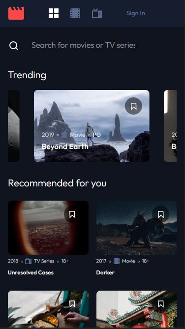
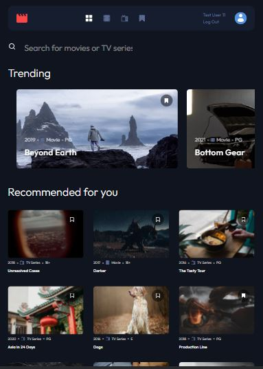
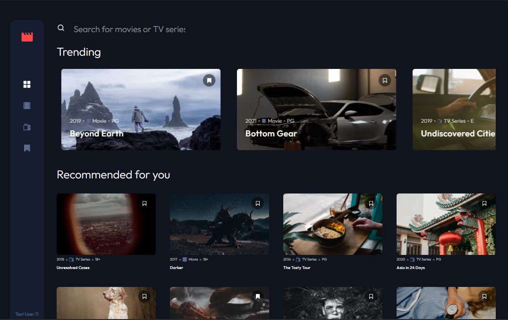

# Frontend Mentor - Entertainment web app

This is a solution to the [Entertainment web app challenge on Frontend Mentor](https://www.frontendmentor.io/challenges/entertainment-web-app-J-UhgAW1X).

## Table of contents

- [Overview](#overview)
  - [The challenge](#the-challenge)
  - [Screenshot](#screenshot)
- [My process](#my-process)
  - [Built with](#built-with)
- [Installing](#Installing)
- [Links](#Links)

---

## The challenge

The challenge is to build out this entertainment web application and get it looking as close to the design as possible (using any tools).

Your users should be able to:

- View the optimal layout for the app depending on their device's screen size
- See hover states for all interactive elements on the page
- Navigate between Home, Movies, TV Series, and Bookmarked Shows pages
- Add/Remove bookmarks from all movies and TV series
- Search for relevant shows on all pages
- **Bonus**: Build this project as a full-stack application
- **Bonus**: If you're building a full-stack app, we provide authentication screen (sign-up/login) designs if you'd like to create an auth flow

### Expected Behaviour

- General
  - The navigation menu should be fixed to the left for larger screens. Use the "Desktop - Home" page in the design as a visual reference.
- Home
  - The trending section should scroll sideways to reveal other trending shows
  - Any search input should search through all shows (i.e. all movies and TV series)
- Movies
  - This page should only display shows with the "Movie" category
  - Any search input should search through all movies
- TV Series
  - This page should only display shows with the "TV Series" category
  - Any search input should search through all TV series
- Bookmarked Shows
  - This page should display all bookmarked shows from both categories
  - Any search input should search through all bookmarked shows

---

## Screenshot

- 375px, 768px:

|                                          |                                          |
| ---------------------------------------- | ---------------------------------------- |
|  |  |

- 1440px:

## 

## 

## My process

## Built with

- React JS library
- Tailwind CSS
- Mobile-first workflow
- Node.js Express.js
- REST API
- Mongoose, MongoDB
- jsonwebtoken

## Installing 🔍

To install this application:

```
npm install
npm start

P.S. I’m using Render hosting for the Backend. Since Web Services on the free instance type are automatically spun down after 15 minutes of inactivity,  when a new request comes in, Render wakes up after 30 seconds
```

##

## Links

- Solution URL: [Netlify - Entertainment web app](https://movies-app-t.netlify.app/)
